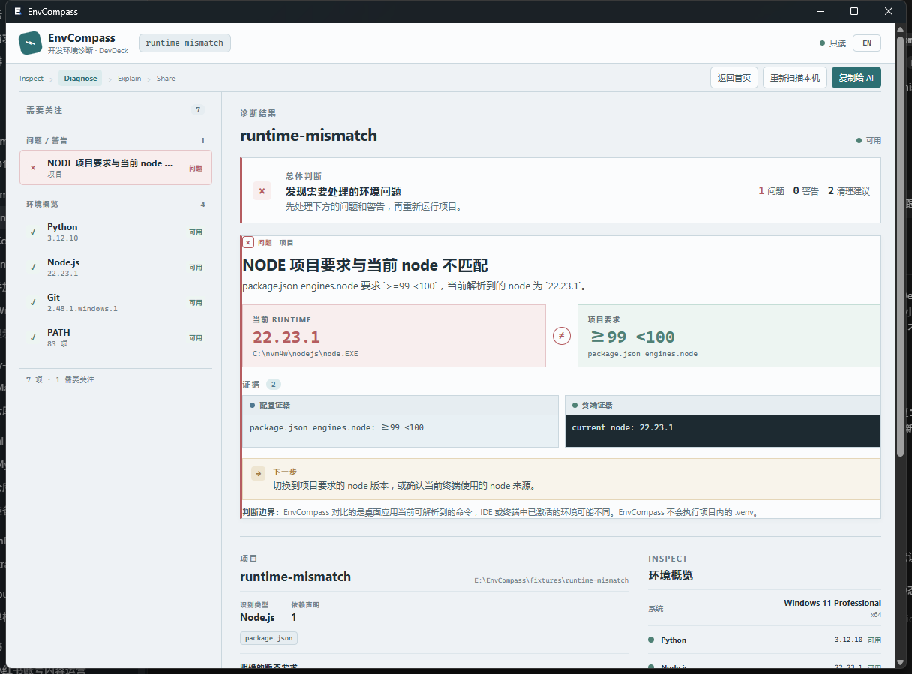
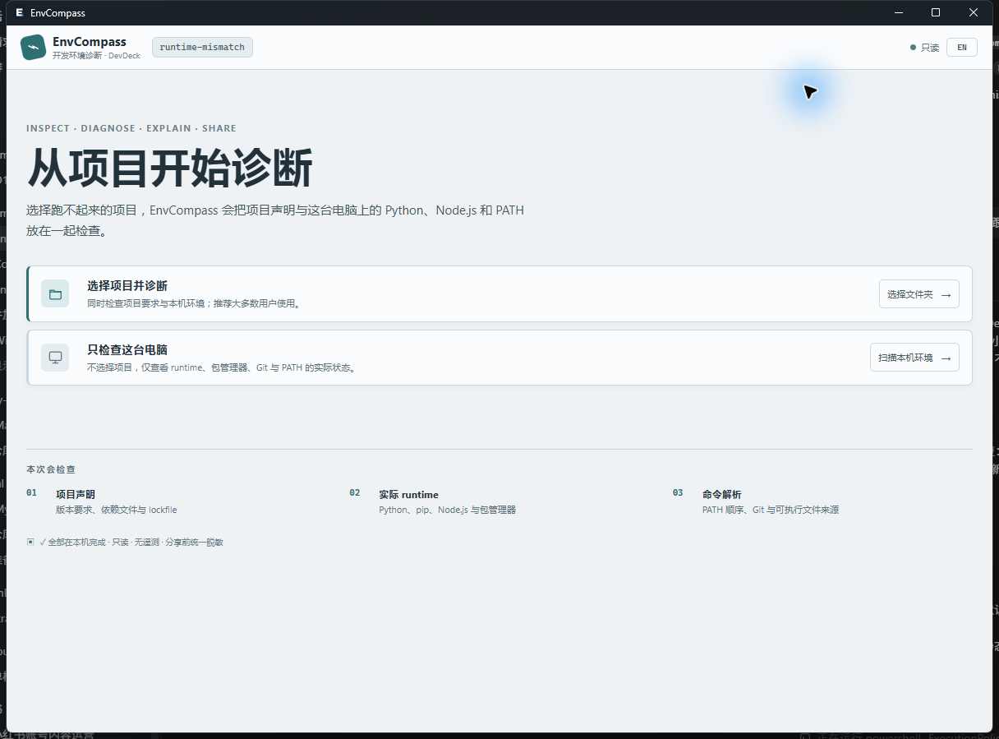

# EnvCompass

## 为什么你的项目又跑不起来了？

EnvCompass 是一个 Windows 开发环境诊断工具。它会把项目声明与本机实际使用的 Python、Node.js、PATH、Git 放在一起检查，找出有证据的版本冲突和路径异常，并生成可以直接发给 AI 或其他开发者的脱敏报告。

**检查 → 诊断 → 解释 → 分享**

[下载 Windows Preview](https://github.com/XiaojuCH/EnvCompass/releases) · [English](./README.en.md)

当前 Preview 面向 Windows x64。扫描全部在本机完成；EnvCompass 不上传数据、不修改系统、不执行项目脚本，也没有账号或遥测。



## 下载与安装

普通用户不需要 clone 仓库，也不需要预先安装 Python、Node.js 或 Rust。

1. 打开 [GitHub Releases](https://github.com/XiaojuCH/EnvCompass/releases)，选择页面中最新、标记为 **Pre-release** 的 EnvCompass Preview。
2. **大多数用户：**下载名称以 `-windows-x64-setup.exe` 结尾的安装包。
3. **不想安装：**下载名称以 `-windows-x64-portable.zip` 结尾的压缩包，解压一次后运行 `EnvCompass.exe`。
4. **需要 MSI：**选择名称以 `-windows-x64.msi` 结尾的文件；它需要管理员权限，是高级备用安装包。普通用户请选择 setup EXE。
5. 使用同一 Release 中的 `SHA256SUMS.txt` 核对下载文件。

> Preview 构建目前没有代码签名，Windows SmartScreen 可能显示警告。请确认文件来自本仓库的 GitHub Release，并核对 SHA-256；不需要关闭或永久绕过 Windows 安全功能。

当前 Preview 的应用版本保持 `0.1.0`；具体 Preview 编号以所选 GitHub Release / tag 为准。

## 它现在能做什么

- **选择项目并诊断：**对照项目要求与本机实际 runtime，这是推荐入口。
- **扫描这台电脑：**检查 PATH、Python / pip、Node.js / 常见包管理器与 Git 的实际解析位置和版本。
- **解释有证据的问题：**报告 runtime mismatch、包管理器不匹配和真实的命令解析异常；无法判断时不会猜测。
- **识别 Python 项目：**读取有边界的 `.python-version`、`pyproject.toml`、`requirements*.txt`、`environment.yml/.yaml`、`setup.py`、`setup.cfg`、`Pipfile`、`Pipfile.lock`、`poetry.lock`、`uv.lock`。
- **识别 Node.js 项目：**读取 `.nvmrc`、`.node-version`、`package.json`、`engines.node`、`packageManager` 与常见 lockfile。
- **识别 metadata-light Python 项目：**有边界地统计 `.py` 文件，但不读取或执行源码；缺少版本声明时明确显示“无法可靠判断”。
- **分享诊断：**生成简明的“复制给 AI”报告，以及包含完整工具清单和 PATH 的技术报告。
- **中文 / English：**GUI 提供 `zh-CN` 与 `en-US`，默认跟随 Windows 语言。

下图使用仓库内的 synthetic fixture；它故意声明无法满足的 Node.js 版本范围，用于展示有证据的 mismatch，而不是用户真实扫描数据。



## 隐私与只读边界

本地 GUI 会显示真实路径，帮助当前用户排查；复制和保存报告属于独立的分享边界，统一经过 sanitizer：

- 项目根目录替换为 `%PROJECT_ROOT%`；
- 用户目录、常见系统目录和其他本地/网络绝对路径使用占位符；
- 不读取或输出 `.env` 值、环境变量值或源码内容；
- 过滤常见 API key、token、password、proxy credential 与 URL 模式。

Sanitizer 可以降低常见泄露风险，但不能保证识别所有未知凭据格式。分享前仍应快速检查，尤其不要把未经检查的完整报告直接放进公开 Issue。

EnvCompass v0.1 是只读诊断工具，不是环境管理器。它不会修改 PATH、Registry、环境变量或项目文件，不会安装/卸载 runtime，不会自动修复，也不会执行扫描项目中的脚本。

## 当前范围

当前已验证的打包目标是 Windows x64；开发与真实工作流验证在 Windows 11 完成。暂不包含 Conda 深度诊断、CUDA、YOLO / PyTorch 配置、Docker、WSL、Java、自动修复、内置 AI、云同步或 telemetry。

未来方向见 [ROADMAP.md](./ROADMAP.md)。计划中的 Recipes 会优先创建隔离环境，而不是修改系统 Python、PATH 或现有项目；当前尚未实现。

## 从源码开发

只有贡献者需要 Node.js、Rust MSVC toolchain 和 Tauri 前置依赖：

```powershell
npm ci
npm run tauri:dev
```

运行完整检查：

```powershell
npm test
npm run build

cd src-tauri
cargo fmt --all -- --check
cargo test --locked
cargo clippy --locked --all-targets --all-features -- -D warnings
```

构建 Windows release：

```powershell
npm run tauri:build
```

## 参与项目

提交较大改动前请先创建 Issue，并阅读 [CONTRIBUTING.md](./CONTRIBUTING.md) 与 [SECURITY.md](./SECURITY.md)。不要提交真实扫描数据、私人路径或 secret。

EnvCompass 使用 [MIT License](./LICENSE)。
